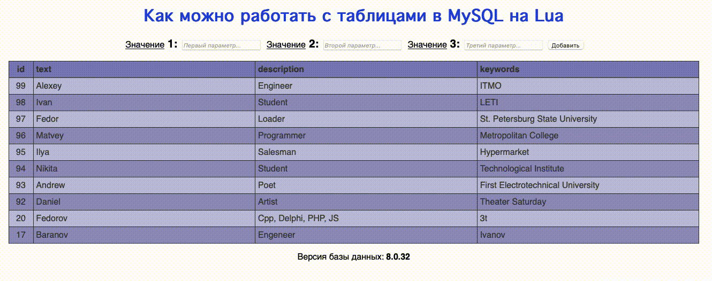
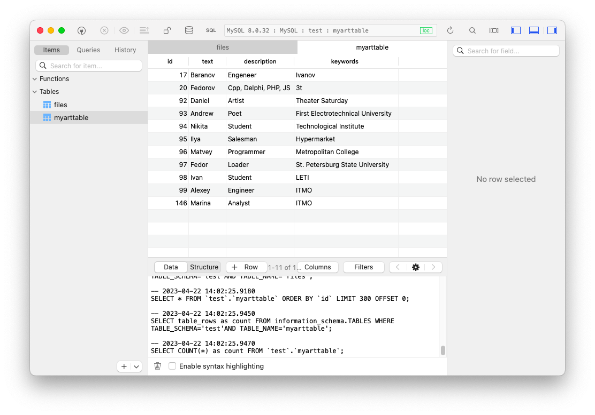
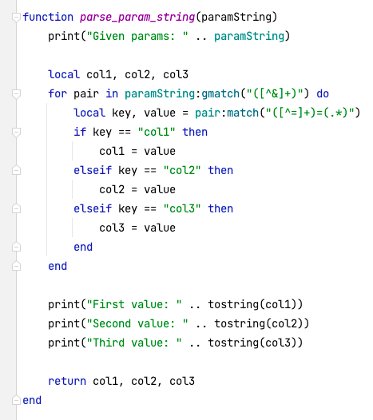
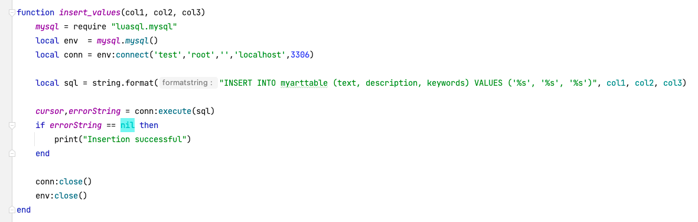

# Задание на повышение оценки:

Выше показана демонстрация работы программы – введенная информация успешно сохраняется в базу, в чем можно убедиться ниже:

### Добавлена функция обработки параметров:

Данная функция возвращает значения из строки параметров как переменные

### Добавлена функция вставки значений в таблицу:

Данная функция подключается к БД по релеватным учетным данным, и исполняет SQL-запрос

### Вывод:
Таким образом, можно с помощью языка Lua взаимодействовать с базой данных MySQL